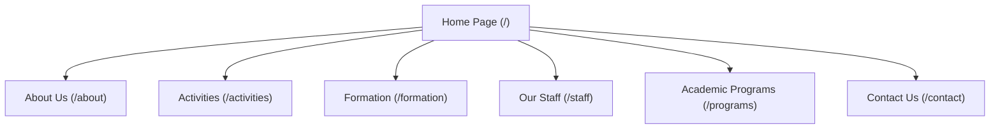

# Maynilad University Center Website - Documentation

This document provides a comprehensive overview of the Maynilad University Center website, its structure, and the detailed contents of each webpage in the frontend application.

---

## 1. Overview & Purpose

The **Maynilad University Center** is an academic and formation center for university men (primarily college students in Manila). The website serves as a digital brochure and portal to inform prospective students, parents, and community members about the center's mission, values, academic assistance, personal mentoring, and spiritual activities.

The website's primary tagline is: **"Where Greatness in the Ordinary Begins"**
Its primary educational vision is: **"Forming Leaders of Competence, Conscience, and Compassion"**

---

## 2. Technical Architecture

* **Frontend**: Built using **Next.js** (React) with **TypeScript** and **Tailwind CSS**.
* **Styling**: Utilizes custom CSS classes (configured via Tailwind in [tailwind.config.js](file:///d:/School%20Files/Personal%20Files/Maynilad-V2/frontend/tailwind.config.js)) with a dark green and gold color scheme representing the corporate identity.
* **Animations**: Integrates scroll-based transitions via an `AnimatedSection` component.
* **Backend**: Integrates with a local mock JSON-Server API located in the `backend/` directory to serve dynamic data (such as programs and events).

---

## 3. Sitemap & Page-by-Page Contents

The website consists of 7 primary views located inside the [app](file:///d:/School%20Files/Personal%20Files/Maynilad-V2/frontend/app) directory:



### 3.1. Home Page (`/`)
* **File Location**: [page.tsx](file:///d:/School%20Files/Personal%20Files/Maynilad-V2/frontend/app/page.tsx)
* **Purpose**: Serves as the landing page providing a summary of Maynilad's offering, statistics, upcoming events, and a portal to join.
* **Key Sections**:
  * **Hero Section**: Features a full-screen background image of the university center with a dark overlay, the main tagline, and buttons linking to `/about` and `/contact`.
  * **Key Stats Counter**: Displays institutional metrics:
    * *20+ Years of Formation*
    * *500+ Students Formed*
    * *6 Programs*
    * *12+ Staff & Mentors*
  * **About Us Preview**: Introduces the center's educational focus on competence, conscience, and compassion, accompanied by an image of the students.
  * **Life at Maynilad Photo Grid**: Interactive visual grid highlighting different aspects of student life: *Academic Life*, *Sports*, *Cultural Events*, *Formation*, and *Community*.
  * **What We Offer (Overview)**: Summarizes the four pillars of activities (Academic Development, Cultural & Outdoors, Spiritual Formation, and Community Outreach) in card format.
  * **Upcoming Events Calendar**: Previews dates for seasonal events like pilgrimages, recollections, and sports gatherings.
  * **Call to Action (CTA)**: Prompts prospective members to take the first step. Features a QR code image to register and a link to the Contact page.

---

### 3.2. About Us (`/about`)
* **File Location**: [about/page.tsx](file:///d:/School%20Files/Personal%20Files/Maynilad-V2/frontend/app/about/page.tsx)
* **Purpose**: Explains who Maynilad is, its history, values, and institutional vision.
* **Key Sections**:
  * **Mission & Vision**:
    * **Mission**: Providing quality formation that integrates academic excellence with values development, preparing competent, ethical, and socially responsible professionals.
    * **Vision**: To be a leading institution in holistic formation, enabling individuals to excel professionally while contributing positively to society.
  * **Our History Timeline**: Chronological milestones mapping the journey of the center:
    * *1995 (Foundation)*: Established as a small academic support center in Manila.
    * *2005 (Expansion)*: Expanded facilities and introduced specialized formation.
    * *2015 (Growth)*: Steady growth in membership and partnerships across Metro Manila.
    * *2025 (Today)*: Serves hundreds of students with robust programming, state-of-the-art facilities, and a strong alumni network.
  * **Core Values**: Explains the 6 guiding principles:
    1. **Excellence** (Highest standards in academic/formative endeavors)
    2. **Integrity** (Honesty, ethical behavior, and accountability)
    3. **Service** (Contributing to society and social responsibility)
    4. **Leadership** (Guiding others with vision, empathy, and common good)
    5. **Innovation** (Creative, forward-thinking approaches)
    6. **Community** (Supportive environment celebrating diversity)

---

### 3.3. Activities & Events (`/activities`)
* **File Location**: [activities/page.tsx](file:///d:/School%20Files/Personal%20Files/Maynilad-V2/frontend/app/activities/page.tsx)
* **Purpose**: Details the activities, sports events, outreach initiatives, and comprehensive event calendar.
* **Key Sections**:
  * **Student Activities Grid**: Showcases types of student involvement with image cards:
    * *Academic Competitions*: Debates, quiz bowls, research symposiums.
    * *Cultural Festivals*: Music, dance, art exhibitions, and theater.
    * *Sports Events*: Basketball, volleyball, and track teams.
  * **Detailed Event Schedule**: Lists upcoming events with specific color-coded tags representing categories:
    * **Spiritual** (e.g., La Naval de Manila Pilgrimage, Our Lady of Caysasay Pilgrimage)
    * **Formation** (e.g., Recollection & Cookout)
    * **Sports** (e.g., Basketball Game at PARQAL)
    * **Academic** (e.g., Annual University Fair)
    * **Leadership** (e.g., Leadership Summit)
  * **Community Outreach Program**: Illustrates the center's commitment to social contribution, listing initiatives like volunteer teaching, environmental advocacy, community livelihood projects, and medical missions.

---

### 3.4. Formation Program (`/formation`)
* **File Location**: [formation/page.tsx](file:///d:/School%20Files/Personal%20Files/Maynilad-V2/frontend/app/formation/page.tsx)
* **Purpose**: Outlines the core framework of Maynilad's character, academic, and spiritual mentoring programs.
* **Key Sections**:
  * **The Four Pillars of Holistic Formation**:
    1. **Character Development**: Developing virtues (integrity, responsibility, perseverance, respect) through workshops and mentoring.
    2. **Spiritual Growth**: Spiritual reflection, voluntary retreats, recollections, and ethical discussions.
    3. **Intellectual Formation**: Enhancing academic capabilities through study circles, coaching, and seminars.
    4. **Apostolic Formation**: Cultivating a spirit of service, mission, and friendship.
  * **Mentoring Program**: Focuses on regular one-on-one sessions with experienced mentors who assist with personal growth, academic and career goals, and life skills.
  * **Leadership Development**: Details training in three main competencies: *Communication*, *Team Building*, and *Ethical Leadership*.

---

### 3.5. Our Staff & Chaplaincy (`/staff`)
* **File Location**: [staff/page.tsx](file:///d:/School%20Files/Personal%20Files/Maynilad-V2/frontend/app/staff/page.tsx)
* **Purpose**: Introduces the leadership team, academic mentors, and spiritual directors of the center.
* **Key Sections**:
  * **Active Staff Grid**:
    * **Arwin Vibar** (Director & UP Manila Associate Professor): Leads intellectual formation.
    * **Janjan Ramirez** (Vice Director & Economist): Mentors on social and economic leadership dimensions.
    * **Ariel de Castro** (Dual Tech Staff): Connects academic theory with technical and workforce competencies.
    * **Raymond Ng** (DLSU Assistant Professor Lecturer): Leads education and leadership development.
    * **Donnell Dimaano** (Digital Media): Guides students in creative and responsible digital media usage.
  * **The Chaplaincy**: Prominently highlights the spiritual guidance department.
    * **Fr. Dennis Yu** (Chaplain): Administers Sacraments, leads retreats, and provides spiritual direction, centering on finding God in ordinary daily work.

---

### 3.6. Academic Programs (`/programs`)
* **File Location**: [programs/page.tsx](file:///d:/School%20Files/Personal%20Files/Maynilad-V2/frontend/app/programs/page.tsx)
* **Purpose**: Displays mock or actual university degree pathways supported at the center, along with requirements and admissions procedures.
* **Key Sections**:
  * **Program Catalog**: Displays courses (populated dynamically from the JSON backend service in [services/api.ts](file:///d:/School%20Files/Personal%20Files/Maynilad-V2/frontend/app/services/api.ts) with fallbacks):
    * *BS in Computer Science* (School of Engineering and Technology - 4 Years)
    * *BA in Philosophy* (School of Humanities - 4 Years)
    * *Master of Business Administration (MBA)* (School of Business - 2 Years)
  * **Admission Requirements**:
    * *Undergraduate*: Application form, high school transcript, good moral character certificate, entrance exam, photos, and admissions interview.
    * *Graduate*: Application form, relevant Bachelor's degree, official transcript, 2 recommendation letters, statement of purpose, CV, and director interview.
  * **Application Process Steps**:
    1. *Submit Application*
    2. *Entrance Exam*
    3. *Admissions Interview*
    4. *Admission Decision*

---

### 3.7. Contact Us (`/contact`)
* **File Location**: [contact/page.tsx](file:///d:/School%20Files/Personal%20Files/Maynilad-V2/frontend/app/contact/page.tsx)
* **Purpose**: Enables users to contact the center administration, view office hours, and find the location map.
* **Key Sections**:
  * **Contact Details**:
    * *Address*: 5th Floor, Pablo Ocampo Sr. Street corner Taft Avenue, Manila 1004.
    * *Phone*: (632) 8637-0912 to 26
    * *Email*: info@maynilad.edu
    * *Office Hours*: Monday–Friday (8:00 AM – 5:00 PM), Saturday (8:00 AM – 12:00 PM).
  * **Interactive Inquiry Form**: A client-side form letting visitors send messages directly. Contains validation and a success state confirmation upon submission.
  * **Embedded Map**: An embedded Google Maps frame showing the precise location of the center near Taft Avenue in Manila.

---

## 4. Key Directory Structure

```text
frontend/
├── app/
│   ├── about/            # About Us page
│   ├── activities/       # Activities page
│   ├── components/       # Custom React components (AnimatedSection, StatsCounter)
│   ├── contact/          # Contact page
│   ├── formation/        # Formation Program page
│   ├── programs/         # Academic Programs page
│   ├── services/         # API Service (fetches from backend)
│   ├── staff/            # Staff page
│   ├── styles/           # Custom style definitions
│   ├── globals.css       # Main global styling
│   ├── layout.tsx        # Base template (navigation, header, footer wrapper)
│   └── page.tsx          # Homepage
├── public/               # Static assets (images, QR code, logos)
├── tailwind.config.js    # Tailwind layout utility customization
└── package.json          # Dependency manifestations
```
